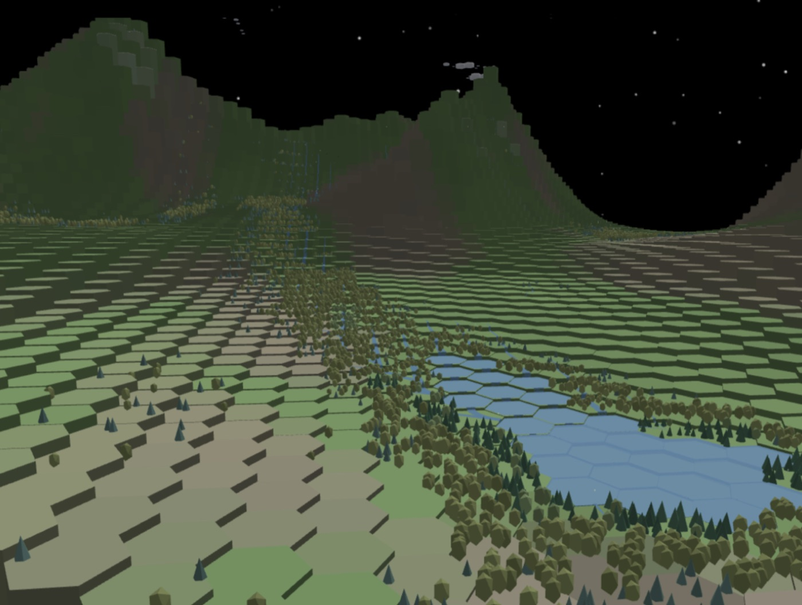
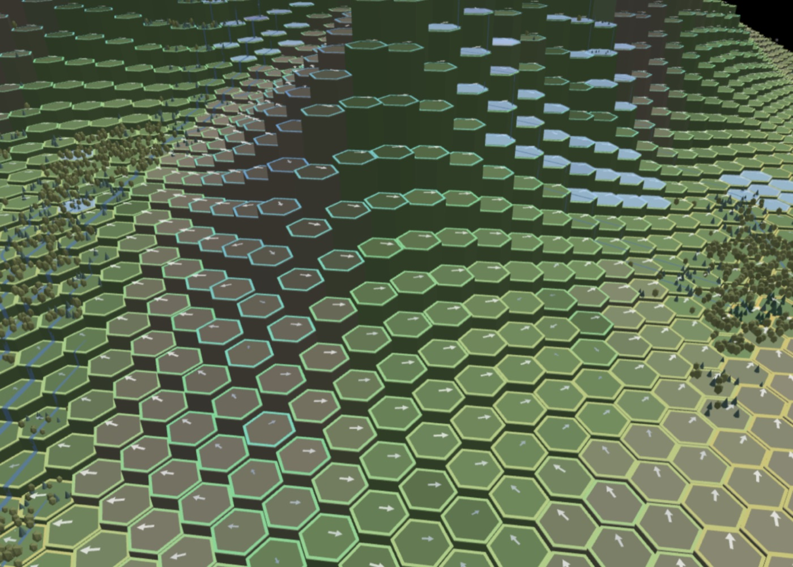

An emergent geophysical world on a hex grid, in Rust.

No player, no objective, nothing to win. I wanted a world that runs on its own,
and to watch what it does with itself. The rules are local, a cell and its six
neighbours, and everything above that is a consequence.

So far the consequences are rivers that carve their own beds, lakes that fill
and drain, snow that holds on north faces and goes on south ones, forests that
take two centuries to reach climax. None of it is drawn. The terrain comes out
of a seed, the rest falls out of the physics.

A thalweg is the line along the bottom of a valley where running water
concentrates. That one isn't drawn either, it follows from the slope.

I mostly run it the way you watch a fire. The long-term plan is to put agents
on the map and see whether they organise themselves, but the ground has to
hold first.




## How it works

A closed terrarium. Water and energy are conserved quantities: if a total
drifts, that is a bug, and it is the project's most fundamental test
invariant.

- **Hex grid**, axial coordinates `(q, r)`, six neighbours per cell. Radius 45
  by default, about 6 200 hexes, roughly 1.46 ha each.
- **One tick is one hour**, twenty-four per simulated day, which is what makes
  a diurnal cycle possible at all.
- **Double buffering**: every tick reads from `current` and writes into
  `next`, so the order cells are visited in cannot change the result.
- **Each phenomenon is a pure function** over a cell and its neighbours. They
  never call each other; they interact only through the properties they
  mutate.
- **A single seed determines the entire world**, terrain included.



The arrows are the wind field, one vector per cell. The dark line running
through the middle is a thalweg: nothing marks it as one, it is simply where
the slope sends the water.

Physics is written in strict SI units — W/m² for energy fluxes, J/(m²·K) for
surface heat capacities, Pa for pressures — with the fundamental constants
declared explicitly and their source named in the code. Dimensionless
hand-tuned coefficients that absorb several distinct phenomena are not
accepted: a coefficient with no named physical unit is a signal that it must
be decomposed into separate SI fluxes.


## Layout

```
simulation/crates/
  hexsim-core/      the engine: grid, phenomena, diagnostics (~38 000 lines)
  hexsim-cli/       server: WebSocket, msgpack snapshots, control API
  hexsim-proto/     wire types shared by the server and its clients
  hexsim-wasm/      the same engine, compiled for the browser
  hexsim-wsclient/  WebSocket client used by the tooling
  hexsim-mcp/       MCP bridge (stdio ↔ WebSocket)
frontend/           three.js visualisation, WASM or WebSocket transport
```

The engine is decoupled from the visualisation: it produces a serialised
state, an external consumer renders it. Over the WebSocket, snapshots are
column-compact msgpack — field names are sent once per frame, not once per
cell — while commands, targeted answers and logs stay JSON text.


## Run it

Two ways, both from a clone. Either needs [Rust](https://rustup.rs) and
[just](https://github.com/casey/just).

**In a browser, no backend.** The engine compiles to WebAssembly and the whole
simulation runs in the tab, on a single thread inside a Web Worker.

```bash
just wasm-setup   # once: wasm32 target, wasm-pack, binaryen
just build-web    # produces dist/, a static site any file host can serve
just serve-web    # serves it on localhost:8099
```

**As a native server**, which is faster and exposes the control API the
tooling drives (`just step`, `just diag`, `just param`).

```bash
just front-setup  # npm install for the front end, served locally, no CDN
just run          # server on localhost:8355
```

And once, to wire fmt + clippy into every commit:

```bash
./scripts/install-hooks.sh
```


## Commands

`just` alone lists them all. The ones worth knowing:

| | |
|---|---|
| `just check` | fmt + clippy + the fast suite (~20 s) |
| `just check-all` | same with the full suite, scale tests included (~2 min) |
| `just step 30` `just year` | advance the running simulation |
| `just diag` | compact diagnostics of the current state |
| `just shot` | screenshot the 3D scene (Playwright) |

The test suite is 403 tests across 82 integration files. Physical invariants
(mass and energy conservation) are checked with `proptest`; a separate family
of very small, very fast tests pins behaviours that are obvious to state and
were hard to obtain — saturation rises with temperature, a fire goes out and
stays out, a south-facing slope is warmer than a north-facing one.

Clippy runs with `all = deny` and `pedantic = warn`, hardened to `-D warnings`
by the pre-commit hook. Silencing a lint with `#[allow]` is not accepted.


## License

MIT. See [LICENSE](LICENSE).
